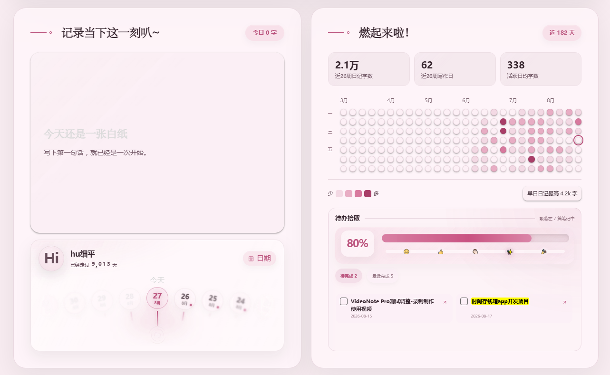
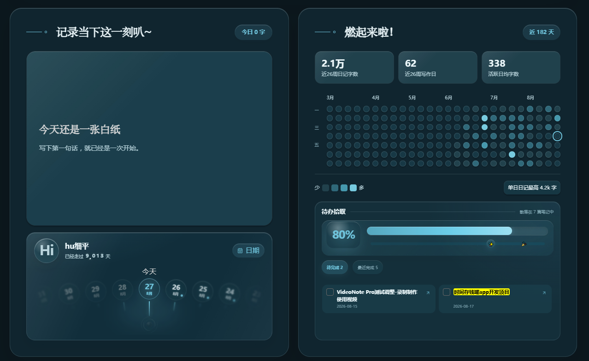

<div align="center">

# 每日专注主页

### 把每日笔记、待办与写作积累，收拢到一个安静的本地主页。

[](https://github.com/hu2849901083-source/alex-desk/releases)
[](LICENSE)

**中文界面 · 本地优先 · 桌面端 · 原 Alex Desk**

</div>

## 界面预览

| 浅色模式 | 深色模式 |
| --- | --- |
|  |  |
|  |  |

## 插件简介

每日专注主页是一款以文字和注意力为中心的桌面端主页插件。它直接读取仓库内的 Markdown 文件，把每日笔记、分散待办、写作字数、记录热力图和日期回看整合到一个可追溯的主页中，不需要 Dataview、Templater 或云端账户。

插件原名 **Alex Desk**。从 `1.10.21` 起更新展示名称，但保留插件 ID `alex-desk`，因此已有安装目录和本地设置可以继续使用。

## 主要功能

- 多图横幅、轮播、上下取景与弹性画布悬停效果
- 全库笔记数、字数、本月记录等可展开统计
- 当日笔记 Markdown 阅读与来源跳转
- 汇总全库或指定多个文件夹中的 Markdown 待办
- 在主页直接完成任务，并显示最近完成的 5 条记录
- 12–52 周写作热力图与来源追溯
- 人生日期回看、月历与写作日期提示
- 自动、白天、黑夜模式及多套主题配色
- 可选系统音频频谱、四种样式、颜色和响应阈值
- 响应式布局与“减少动态效果”适配

## 隐私与系统要求

- 笔记内容、文件路径、统计和设置均在本地处理，不上传、不遥测。
- 插件使用桌面端能力，因此不支持 Obsidian 移动版。
- 系统音频频谱默认关闭。Windows 上启用后会在本地调用 PowerShell 读取系统输出峰值；它不录音、不保存音频、不识别内容。其他桌面系统可能改用系统屏幕/音频共享接口并显示权限窗口。
- 封面图片和头像只使用仓库内部路径。

完整说明见 [隐私说明](PRIVACY.md) 和 [安全策略](SECURITY.md)。

## 从社区插件市场安装

插件通过审核后：

1. 打开 Obsidian「设置 → 第三方插件」。
2. 关闭受限模式并点击「浏览」。
3. 搜索“每日专注主页”“每日笔记”“待办”或“写作热力图”。
4. 点击安装并启用。

## 手动安装

1. 在 [Releases](https://github.com/hu2849901083-source/alex-desk/releases) 打开与 `manifest.json` 版本一致的 Release。
2. 下载 `main.js`、`manifest.json`、`styles.css` 三个独立附件。
3. 放入 `<你的仓库>/.obsidian/plugins/alex-desk/`。
4. 重新加载 Obsidian，在「设置 → 第三方插件」中启用。

也可以通过 BRAT 添加测试仓库：

```text
hu2849901083-source/alex-desk
```

## 首次设置

进入「设置 → 每日专注主页」，至少确认以下内容：

1. 每日笔记文件夹与日期格式。
2. 封面图片和头像的仓库内部路径。
3. 待办来源：留空表示扫描整个仓库，也可以按行填写多个文件夹。
4. 热力图统计周期和数据指标。
5. 是否启用系统音频频谱。

## 开发与构建

```bash
npm install
npm run build
npm run check
```

源码位于 `src/`。构建会把弹性画布、OGL 和本地音频采样脚本合并到根目录 `main.js`，确保社区市场只下载 `main.js`、`manifest.json` 和 `styles.css` 时仍能完整运行。

## 发布与贡献

- 发布流程：[PUBLISHING.md](PUBLISHING.md)
- 贡献说明：[CONTRIBUTING.md](CONTRIBUTING.md)
- 更新记录：[CHANGELOG.md](CHANGELOG.md)
- 第三方代码说明：[THIRD_PARTY_NOTICES.md](THIRD_PARTY_NOTICES.md)
- 问题与建议：[GitHub Issues](https://github.com/hu2849901083-source/alex-desk/issues)

## 许可证

项目主体使用 [MIT License](LICENSE)。第三方组件遵循各自许可证，详见 [THIRD_PARTY_NOTICES.md](THIRD_PARTY_NOTICES.md)。
